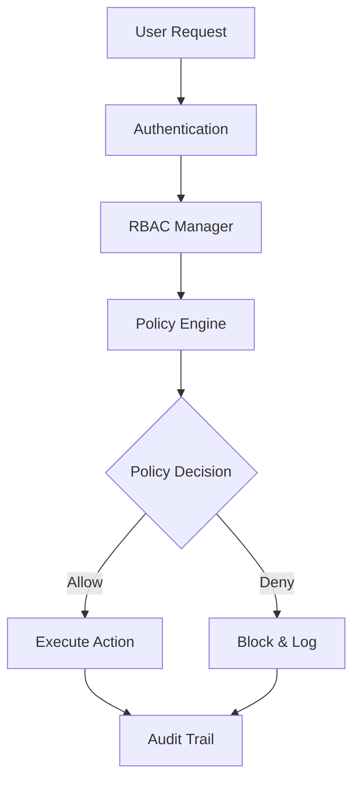

## 📋 Description

Étendre le Policy Engine et implémenter un système RBAC (Role-Based Access Control) complet pour renforcer la sécurité et la gouvernance de FilAgent.

## 🎯 Objectifs

- [ ] Système RBAC multi-niveaux
- [ ] Politiques dynamiques et configurables
- [ ] Audit trail complet
- [ ] Conformité réglementaire renforcée

## 📝 Tâches d'Implémentation

### 1. RBAC (Role-Based Access Control)

#### Définition des Rôles
```yaml
roles:
  admin:
    - all_permissions

  developer:
    - execute_code
    - read_files
    - write_files
    - use_tools

  analyst:
    - read_files
    - execute_queries
    - generate_reports

  viewer:
    - read_only
    - view_logs
```

#### Implémentation
- [ ] Créer système de rôles hiérarchiques
- [ ] Implémenter héritage de permissions
- [ ] Ajouter gestion des groupes
- [ ] Créer API de gestion des rôles

### 2. Policy Engine Extensions

#### Politiques Avancées
- [ ] **Rate Limiting**
  - Limite par utilisateur/rôle
  - Throttling adaptatif
  - Quotas configurables

- [ ] **Resource Control**
  - Limites CPU/mémoire par tâche
  - Timeouts configurables
  - Gestion des priorités

- [ ] **Data Access Policies**
  - Classification des données (Public, Internal, Confidential, Secret)
  - Contrôle d'accès basé sur labels
  - Encryption at rest pour données sensibles

### 3. Guardrails Avancés

- [ ] **Input Validation**
  ```python
  class InputValidator:
      def validate_query(self, query: str, user_role: str) -> ValidationResult:
          # Check for SQL injection
          # Check for command injection
          # Check for path traversal
          # Apply role-specific restrictions
  ```

- [ ] **Output Filtering**
  - Redaction automatique selon le rôle
  - Masquage de données sensibles
  - Watermarking des outputs

### 4. Audit & Compliance

- [ ] **Audit Trail Enhanced**
  - Qui, Quoi, Quand, Où, Comment
  - Tamper-proof logging (blockchain-style)
  - Real-time alerting

- [ ] **Compliance Dashboard**
  ```
  compliance_dashboard/
  ├── regulations/
  │   ├── loi25_quebec.yaml
  │   ├── gdpr_eu.yaml
  │   ├── ai_act_eu.yaml
  │   └── nist_ai_rmf.yaml
  ├── checks/
  │   ├── daily_compliance_check.py
  │   ├── audit_report_generator.py
  │   └── violation_detector.py
  ```

### 5. Integration Points

- [ ] **Middleware Integration**
  ```python
  # runtime/middleware/policy_enforcer.py
  class PolicyEnforcer:
      def __init__(self, rbac_manager, policy_engine):
          self.rbac = rbac_manager
          self.policies = policy_engine

      async def enforce(self, request: Request) -> bool:
          # Check user role
          # Apply policies
          # Log decision
          # Return allow/deny
  ```

- [ ] **API Endpoints**
  ```python
  # POST /api/roles
  # GET /api/roles/{role_id}
  # PUT /api/roles/{role_id}/permissions
  # POST /api/policies
  # GET /api/audit/trail
  ```

## 🛠️ Architecture Technique



## 📊 Métriques de Succès

- 100% des actions auditées
- <10ms latence pour décisions de politique
- 0 bypasses de sécurité
- Conformité 100% avec régulations

## 🔒 Considérations de Sécurité

1. **Zero Trust Architecture**
   - Vérification à chaque étape
   - Principe du moindre privilège
   - Défense en profondeur

2. **Cryptographie**
   - EdDSA pour signatures
   - AES-256-GCM pour encryption
   - PBKDF2 pour passwords

3. **Monitoring**
   - Détection d'anomalies
   - Alertes temps réel
   - Forensics capabilities

## 🏷️ Labels

- `security`
- `compliance`
- `enhancement`
- `high priority`

## 🔗 Références

- [NIST RBAC Model](https://csrc.nist.gov/projects/role-based-access-control)
- [OWASP Security Guidelines](https://owasp.org/)
- [FilAgent Compliance Docs](../docs/COMPLIANCE_GUARDIAN.md)